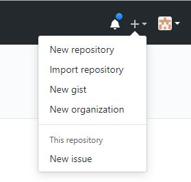
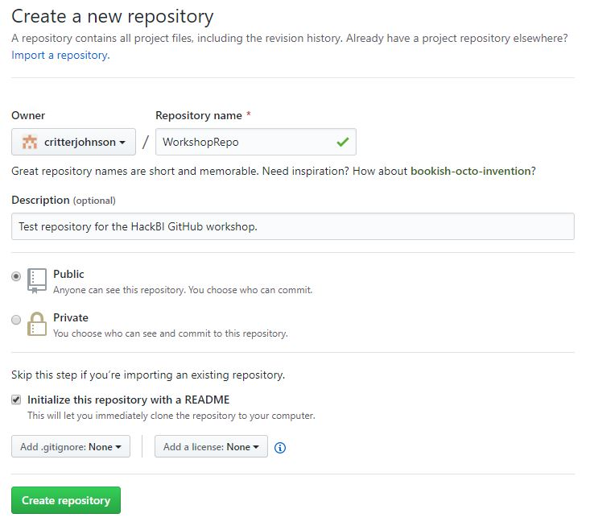
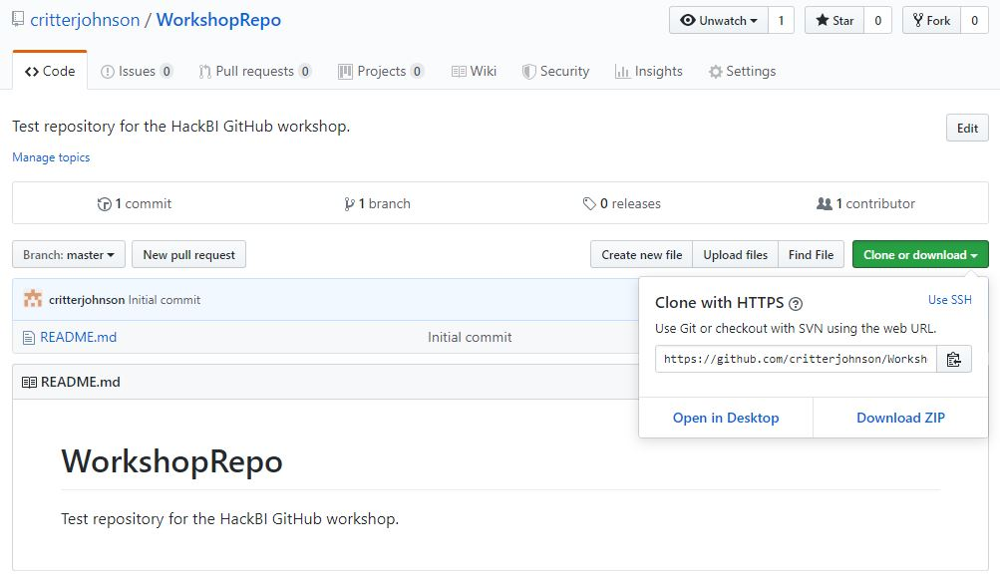
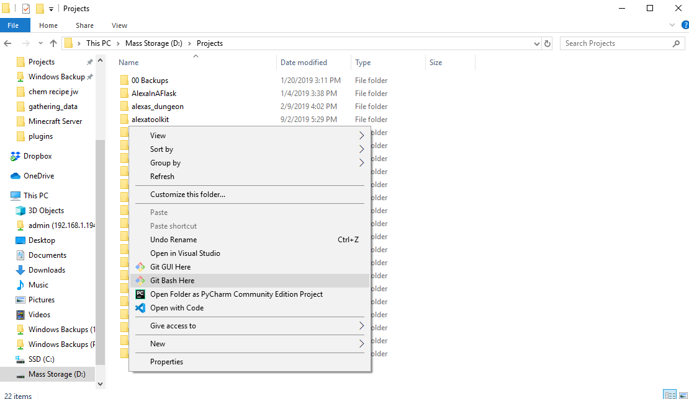

# GitHub Repositories - Create and clone
> Create a repository on GitHub and get it on your computer.

## What is a repository?
Repositories are the main commponent of git. They are folders: they can hold files and other folders; but they contain a special, hidden folder that has information for git. They can be hosted in a remote location and downloaded, or "cloned", locally. The location we are hosting our repos today is GitHub, which is free and the most commonly used git provider.

## Creating a Repo
To create a new repository on GitHub, press the plus at the top right next to your avatar and click "New repository".

Make sure you check the box "initialize this repository with a README". You can name it whatever you want. Click "Create repository" when you're done.

## Cloning your repo
In order to get that repository on your computer, you have to "clone" it. `clone` is a git command that fetches a repository from a remote location, in our case, GitHub. Keep in mind that when you clone it, it will create a new folder, so it's safe to do this from the your project folder. In order to get the link to clone from, click "Clone or download" (the green box on the right) and click on the clipboard icon. This will copy the link to your repository.

### Windows
In File Explorer, right click inside of the folder you want to clone the repository to. Click "git bash here".

Type `git clone <link_to_your_repo>` (you can paste with ctrl + insert), and wait until it completes. Next, type `cd <your_repo_name>` to go to that folder in your terminal.

### Mac
Open your terminal (cmd + space, type "terminal"). This will launch your terminal in your home directory. Type `ls` to see the folders in that directory. Type `cd <folder_name>` to go to a folder in that directory, or `cd ..` to get out. When you're inside of the folder you want to clone your repo to, and type `git clone <link_to_your_repo>`. Once it's finished, type `cd <your_repo_name>` to go to it.

## Other ways to create a repository
You can also create a repo by creating a new folder, navigating to it in your terminal (Mac) or git bash (Windows), and typing `git init`. This will just create a local repo, and you have to jump through some hoops to get it on GitHub.
