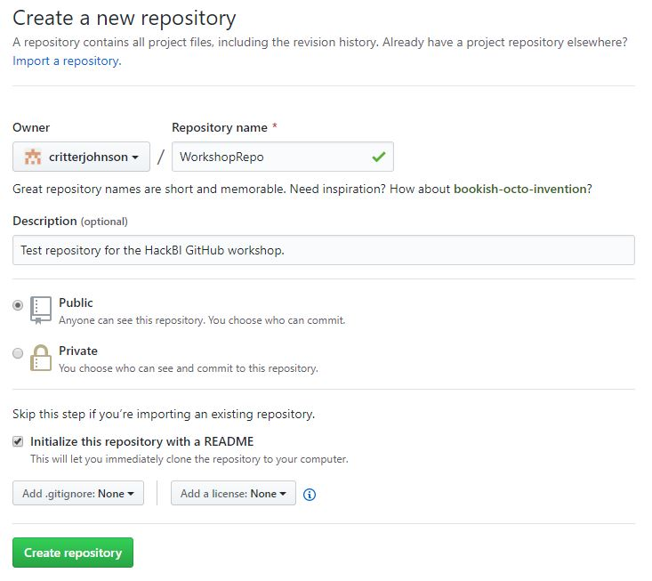
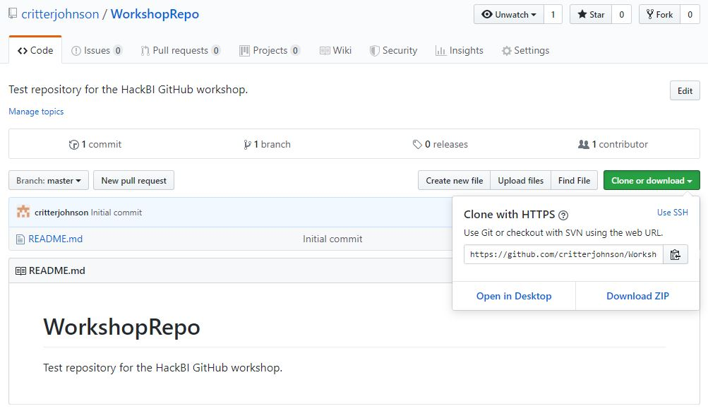

# GitHub Repositories
> Git repositories hosted on GitHub.

## Creating a Repo
To create a new repository on GitHub, press the plus at the top right next to your avatar and click "New repository".

Make sure you check the box "initialize this repository with a README". You can name it whatever you want. Click "Create repository" when you're done.

## Cloning your repo
In order to get that repository on your computer, you have to "clone" it. `clone` is a git command that fetches a repository from a remote location, in our case, GitHub. Keep in mind that when you clone it, it will create a new folder, so it's safe to do this from the your project folder. In order to get the link to clone from, click "Clone or download" (the green box on the right) and click on the clipboard icon. This will copy the link to your repository.

### Windows
In File Explorer, right click inside of the folder you want to clone the repository to. Click "git bash here".

Type `git clone <link_to_your_repo>` (you can paste with ctrl + insert), and wait until it completes. Next, type `cd <your_repo_name>` to go to that folder in your terminal.

### Mac
Open your terminal (cmd + space, type "terminal"). This will launch your terminal in your home directory. Type `ls` to see the folders in that directory. Type `cd <folder_name>` to go to a folder in that directory, or `cd ..` to get out. When you're inside of the folder you want to clone your repo to, and type `git clone <link_to_your_repo>`. Once it's finished, type `cd <your_repo_name>` to go to it.

## Add files to your repo
Go ahead and add a file to that folder. It can be anything: an empty text file, a picture, whatever you want (just don't add something huge like a video so you have to wait for it to upload). Once it's in the repo folder, you have to add it, commit it, and `push` your changes. `push` is another git command that sends your most recent commits to the remote repository.

To add your files, type `git add <file_name>` or `git add --all` to add all unstaged files. To commit them, type `git commit -m <message>`. When you're ready, type `git push` to send them to your repo. If you go back to the GitHub page of your repo and reload it, you'll see your files.

## Get files from your repo
If you're working in your repo with someone else, they can push changes too (if you give them access, which you can do from Settings/Collaborators). However, if they push changes, you don't get them automatically. To get those changes from GitHub, type `git pull`. If you and them change the same file, you're going to get what's called a "merge conflict". Follow the prompts to resolve it, or ask for help.

## Branches and Pull Requests
### Branches
Branches are extremely useful for collaborating on GitHub. With branches, two people can work on the same project and avoid merge conflicts and other annoying things that happen when two people work on the same branch. Create and switch to a new branch with `git checkout -b <branch_name>`. A good branch name is the name of the feature or change you're making.

To switch to your branch on GitHub, click the "branches" dropdown and click on the name of your branch.

### Pull Requests
Once you've made your branch and made some changes, you should merge it in. While you can do this from the command line, the best way to do it is with a Pull Request. Pull Requests on GitHub are requests to merge changes into another branch. They allow you to add reviewers, people who can review, request changes, accept, and deny pull requests. This way, someone can check your work before a branch is merged in. They're useful for large, open source projects - they give a way for anyone and everyone to contribute without project managers being worried bad code will be put on their project.

Before you create a PR, make sure you've pushed your changes to GitHub. If you're pushing changes from a branch GitHub doesn't know exists, you'll get an error message which will tell you to type `git push --set-upstream origin <branch_name>`.

When you're ready to merge in changes, go to "Pull Requests" at the top and click "New pull request".

Click the "compare" dropdown and click on your branch. Click "Create pull request". From the screen it shows you you can add a title, a description, assign reviewers, and a whole lot more. Click "Create pull request", and if there are no merge conflicts, you can click "Merge pull request" and finaly "Delete branch" when it's done. Congratulations! You just merged your first PR.
