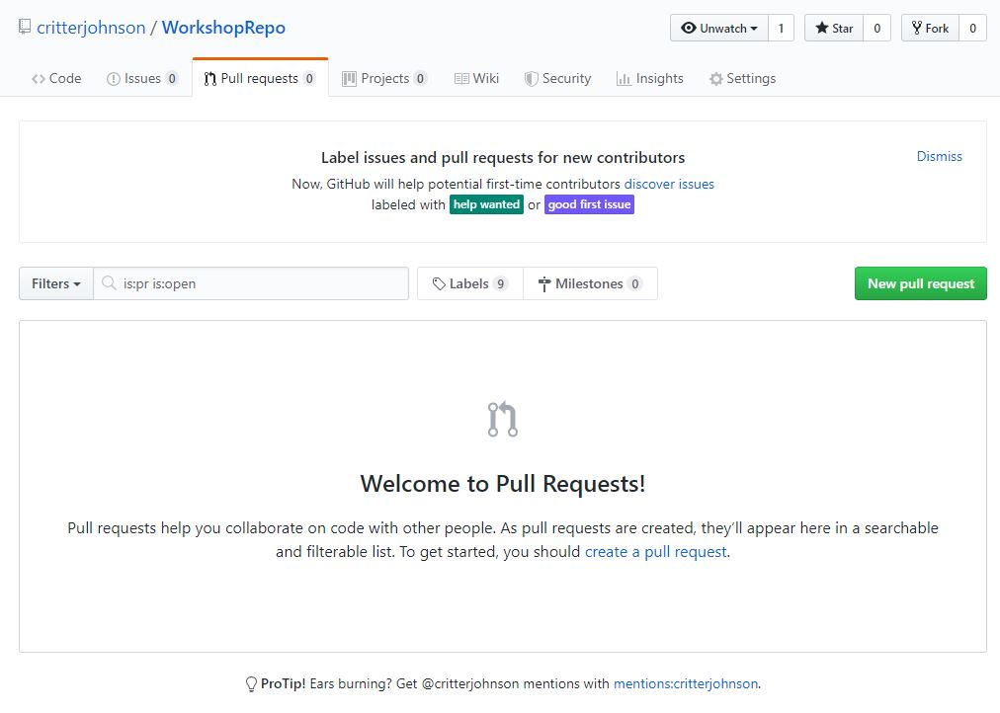

# Pull Requests and `git pull`
> Merge your changes into another branch.

## What are pull requests?
Once you've made your branch and made some changes, you should merge it in to the "master" branch. While you can do this from the command line, the best way to do it is with a Pull Request. Pull Requests are a feature of GitHub (not git) and are requests to merge changes into another branch. They allow you to add reviewers: people who can review, request changes, accept, and deny pull requests. This way, someone can check your work before a branch is merged in. They're useful for large, open source projects - they give a way for anyone and everyone to contribute while giving the project owners complete control over what goes in.

When you're ready to merge in changes, go to "Pull Requests" at the top and click "New pull request".

Click the "compare" dropdown and click on your branch. Click "Create pull request". From the screen it shows you you can add a title, a description, assign reviewers, and a whole lot more. Click "Create pull request", and if there are no merge conflicts, you can click "Merge pull request" and finaly "Delete branch" when it's done. Congratulations! You just merged your first PR.

## Get those changes from GitHub
You just made changes on GitHub, so the copy of your repo on your computer and the one on GitHub are now different. To get the changes from GitHub, switch to the "master" branch with `git checkout master` and "pull" your changes with `git pull`. This will get all of the changes from GitHub (or wherever you are remotely hosting your repo).
